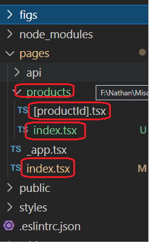
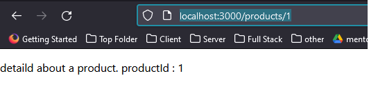

<h2>Motivation</h2>
play with nexxt.js router

<h2>Dynamic route</h2>
<h3>use case</h3>
This is relevant when you want to navigate to e.g. detailed product but you dont know upfront its id

<h3>figs</h3>

<h4>directory structure</h4>



<h4>access details</h4>

invoke this from the browser
http://localhost:3000/products/1

given this code

```ts
import { useRouter } from "next/router";

const ProductDetails = () => {
  const router = useRouter();

  return (
    <div>
      <p>detaild about a product. productId : {router.query.productId}</p>
    </div>
  );
};

export default ProductDetails;
```

You get the following rendered



<h4>important remark</h4>
you can replace the directory products with xxx and the file name [productId].tsx with [yyy].tsx. in this case you will need to access the products details by http://localhost:3000/xxx/1 and use yyy instead of productId in ProductDetails component

<h2>link</h2>

```ts
<Link href={`/products/${id}`}>
  <a>Go to pages/products/[productId].js with productId : {id}</a>
</Link>
```

<h2>Open issue</h2>
why the link is not in blue
